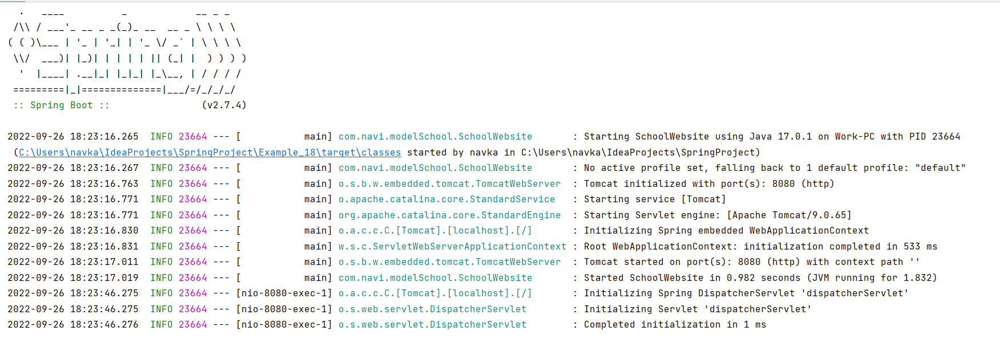
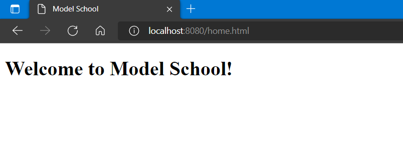

# Spring Boot Started package

1. Created project skeleton from `start.spring.io`
2. Renamed Spring boot application starting point class --> ModelSchool
3. Created a Home html page in src/resources/static package --> `home.html` <br>
   Q: How would spring boot kow that home.html will going to be the main page? <br>
   A: Thanks to Spring boot <span style="color:red"> AutoConfiguration. </span> By default, SpringBoot look for the
   static files under the static folder. So we don't have to do the extra configuration for that unless we have to use
   the different location fot it. <br>
4. `home.html` is the <span style="color:red">View </span> to the web application. <br>
   Q: How would you invoke that page?<br>
   A: When you invoke that path in the browser, spring application has to understand, that it needs to redirect to this
   home.html. For that --> We need to add a <span style="color:red">controller class </span>. <br><br>
    1. Controller packege --> `com.navi.modelSchool.controller`.
    2. under controller package --> `homeController` class
    3. add Annotation `@Controller` on the top of the class name. (if someone is trying to go to `/home` path, they need to
       be redirected to `home.html`). That we do with help of `@RequestMapping` annotation like:
````java
   @Controller
   public class homeController {
            @RequestMapping("/home")
            public String displayHome(){
            return "home.html";
            }
   }
````
This method is not accepting any value and returning the home.html in the String format.

5. Main class always have `@SpringBootApplication`  annotation on it

````java
package com.navi.modelSchool;

import org.springframework.boot.SpringApplication;
import org.springframework.boot.autoconfigure.SpringBootApplication;

@SpringBootApplication
public class SchoolWebsite {

	public static void main(String[] args) {
		SpringApplication.run(SchoolWebsite.class, args);
	}

}

````

#### AutoConfiguration by SpringBoot

 Here : `Tomcat started on port(s): 8080 (http) with context path ''` --> Shows the default Port and Root path.

#### Browser View




       
