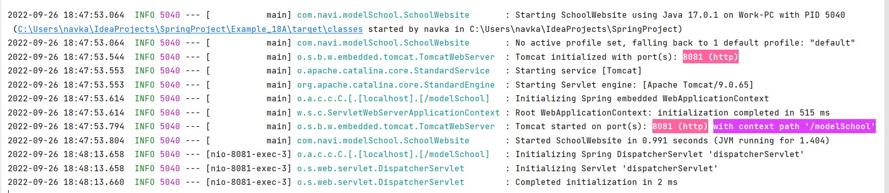

# Changing the default behaviour of the Spring framework

##### Default Behaviour

Default port : 8080 <br>
Context path : ' ' i.e. Blank

##### Modifications

For all the configurations inside the Spring Boot Application, we modify `application.properties` file
under `src/resources/application.properties`. Default configurations will be overridden by mentioning those properties
inside this file.

````
server.port = 8081
server.servlet.context-path= /modelSchool
````


____

#### Browser View


___


___

##### Hence, we have changed the default settings


___

### To automatically assign the port number

put <br>
`server.port= 0` <br>
`Tomcat started on port(s): 56982 (http) with context path ''` <br>
`Tomcat started on port(s): 57152 (http) with context path ''`

### In order to get more Autoconfiguration report on the console

put `debug = true ` property inside the ``application.properties`` file
