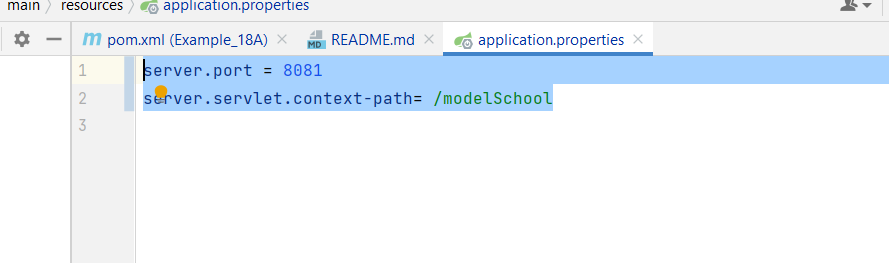

# Changing the default behaviour of the Spring framework

##### Default Behaviour

Default port : 8080 <br>
Context path : ' ' i.e. Blank

##### Modifications

For all the configurations inside the Spring Boot Application, we modify `application.properties` file
under `src/resources/application.properties`. Default configurations will be overridden by mentioning those properties
inside this file.

````
server.port = 8081
server.servlet.context-path= /modelSchool
````


____

#### Browser View


___


___

##### Hence, we have changed the default settings


___

### To automatically assign the port number

put <br>
`server.port= 0` <br>
`Tomcat started on port(s): 56982 (http) with context path ''` <br>
`Tomcat started on port(s): 57152 (http) with context path ''`

## In order to get more Autoconfiguration report on the console

put `debug = true ` property inside the ``application.properties`` file

#### Different headings inside the console.

###### Positive Matches

###### Negative Matches

- means that SpringBoot did not autoconfigure these, because it did not find dependencies for them and therefore won't
  create any bean.

###### Exclusions

- "rare scenario" where you don't want spring to create the bean, and you yourself wanted to create the bean or if
  you have any custom scenarios, in those scenarios, we can mention the exclusion list, during the definition of the
  exclusion list they will come under this Exclusions report.
````java
package com.navi.modelSchool;

import org.springframework.boot.SpringApplication;
import org.springframework.boot.autoconfigure.SpringBootApplication;
import org.springframework.boot.autoconfigure.jdbc.DataSourceAutoConfiguration;

@SpringBootApplication(exclude = {DataSourceAutoConfiguration.class})
public class SchoolWebsite {

	public static void main(String[] args) {
		SpringApplication.run(SchoolWebsite.class, args);
	}

}
````


###### Unconditional classes

- beans are created regardless if dependencies, coz these are the base classes need by the Spring Boot Application to
  run. 