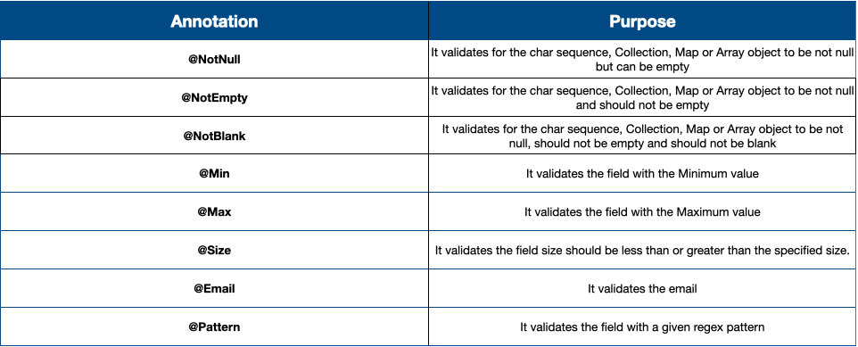

# Validating the form input using Java Bean & Hibernate Validators

1. Adding dependency - Spring-boot-starter-validations and the other library is form hibernate
2. Bean validations work by letting the developers add the constraints to the bean/POJO class itself. This POJO i.e.
   Contact class holding the information coming from the UI page i.e. contact.html.
3. Now, adding the annotation ```` provided by the validations library and define the constraints right on the top of
   these fields.

````java

@Data
public class Contact {
    @NotBlank(message = "Name must not be blank")
    @Size(min = 3, message = "Name must be at least 3 characters long ")
    String name;

    @NotBlank(message = "Mobile number must not be blank")
    @Pattern(regexp = "(^$|[0-9]{10})", message = "Mobile Number must be 10 digits")
    String mobileNum;

    @NotBlank(message = "Email Should not be blank")
    @Email(message = "Please provide a valid email")
    String email;

    @NotBlank(message = "Subject must not be blank")
    @Size(message = "Subject must be 5 characters long")
    String subject;

    @NotBlank(message = "Message must not be blank")
    @Size(message = "Message must be at least 10 characters long")
    String message;
}
````

https://bushansirgur.in/spring-boot-validation-using-hibernate-validator/


4. Integrate this bean both to Front-End and Back-End side with the help of Spring MVC and Thymeleaf framework.
5. Go to ``ContactController`` class, update ``displayContactPage()``. On the top of this method we have to perform the
   bean validation.
    1. Accept ``Model`` in the parameters of the method.
    2. Using model object create an attribute called ``contact``, and inside this attribute send the new object of
       contact class. This was we are indicating to the Thymeleaf, that this page will hold the data belongs to
       the ``contact`` object, and any validations which I defined inside this contact bean should be performed by the
       Thymeleaf and Spring MVC, whenever the user has submitted the data.

````java
@RequestMapping("/contact")
public String displayContactPage(Model model){
        model.addAttribute("contact",new Contact());
        return"contact.html"; // this contact.html referring to the same page not the fresh contact page.
        }
````

6. Once, we are sending this ``contact`` object inside an attribute called  ``"contact"``, we need to go to
   the ``contact.html`` , and build a relationship of this ``contact`` object with the ``contact.html`` form.
7. Go to the form in the ``contact.html``,`` (action="@{/saveMsg}")``,
    1. Inside this form tag, we need to mention Thymeleaf object is equal to "contact". ```th:object="${conatct}```,
       this "contact" is
       the object reference. This is the same attribute name, that we have created on the contact controller. This is
       how we
       have established a link b/w Back-end bean and the Front-End ThymeLeaf.
    2. Next, we need to establish the link between the fields also, like right now, we have ``name`` and ``ìd`` which
       can only be understood by my html page and Thymeleaf but not by the bean validations framework. In order to
       achieve the same, we should also establish the link b/w the fields both in the Front-End and the Back-End bean
       available. For the same, we can use the thymeleaf tag available ``th:field=*{fieldName}`` (fieldName inside the
       POJO class) <br>
       referring:  <br>
       the bean - ``$`` <br>
       files - ``*`` <br>

````thymeleafexpressions
<form th:action="@{/saveMsg}" method="post" class="signin-form" th:object="${contact}">
                    <div class="input-grids">
                        <div class="row">
                            <div class="col-sm-6">
                                <input type="text" th:field="*{name}" placeholder="Your Name" class="contact-input"/>
                            </div>
                            <div class="col-sm-6">
                                <input type="text" th:field="*{mobileNum}" placeholder="Your Mobile Number" class="contact-input"/>
                            </div>
                        </div>
                        <input type="text" th:field="*{email}" placeholder="Your Email" class="contact-input"/>
                        <input type="text" th:field="*{subject}" placeholder="Subject" class="contact-input"/>
                    </div>
                    <div class="form-input">
                        <textarea th:field="*{message}" placeholder="Type your message here"></textarea>
                    </div>
                    <div class="text-start">
                        <button class="btn btn-style btn-style-3">Send Message</button>
                    </div>
                </form>
````

8. Now when the user submitted it will go to the action called- ``/saveMsg`` in contactController class. Here also we
   have to tell Spring-Boot to perform certain Validations after getting field values from tha front-end.
    1. Add ``@Valid``, so that Spring MVC will know, that it has to do validations by looking into the validations
       mentioned inside ``contact.java``.
    2. Inside the contact parameter we need to user ``@ModelAttributr`` annotation. So, what I am telling to this method
       is: There is a Model Attribute with the name ``contact`` , which is bind to ``contact`` object in the method
       parameter variable contact.

    ````java
    @PostMapping(value = "/saveMsg")
    public ModelAndView displayContactPage(@Valid @ModelAttribute("contact") Contact contact){
        contactService.saveContactData(contact);
        return new ModelAndView(("redirect:/contact"));
        }
    ````

    4. If there are any errors as an input to this method identified during this process, my Spring MVC sends this
       information under ``Errors errors`` object. That's why, we need to accept these errors as an input to this
       method, it is my responsibility as a developer to understand if there are errors, then just return to the
       contact.html page, and don't submit the data into the database or don't log that information to my console.
    5. With the help of this ``errors`` object,I can write a small check inside the code. If there are any errors, we
       will
       log the errors like in code below.

    ````java
    @PostMapping(value = "/saveMsg")
    public String saveMessage(@Valid @ModelAttribute("contact") Contact contact, Errors errors) { 
        if (errors.hasErrors()) {
            log.error("Contact form validation failed due to: " + errors.toString());
            return "contact.html"; //This is not the new fresh page but the same page, where user was typing the information.
        }
        contactService.saveContactData(contact);
        return "redirect:/contact"; // This is new page shown when the form is submitter correctly.
    }
    ````

    6. Now we caught those errors we have to show them to the user. For the same, just above the form tag, we add a
       snippet of code. We are using ``th:each`` against the fields ``fields.error``, these errors can have any kind of
       errors inside your WebApplication. But we are particularly interested about the errors available inside
       this ``contact`` bean, that's where I am trying to fetch all the errors available inside the ``contacts.*``. So,
       the thymeleaf expression will fetch the errors ``fields`` for the bean ``contact``. Once we have the list of
       errors, we are trying to iterate the errors with the help of ``th:each`` which is equal to for loop inside the
       java.
    7.

    ````thymeleafexpressions
            <ul>
                <li class="alert alert-danger" role="alert" th:each="error : ${#fields.errors('contact.*')}" th:text="${error}" />
            </ul>
    ````

### Summary

1. Added dependency
2. Added contrasts to POJO.
3. Contact Controller, For the first time accessing contact page, we are sending he ``contact``  object with the
   attribute of same name to get the values for Validations.
4. Linked that to the form page with the help of th object.
5. Defined and linked the Object and fields with the help of th object.
6. During submission, the action will invoke and the method related to that, there we have included the annotations
   `` @Valid `` and ``@ModelAttribute("passes the object which is comming from front-end)``.
7. We are also accepting the errors input parameters for this ``saveMessage()`` method.
8. If there are any errors, we are returning errors to the same page ``contact.html`` otherwise if everything works
   fine, we are redirecting to the fresh ``"redirect:/contact"`` page.
9. If there are any errors, will be sent to same page and those errors will be caught by ``th:error`` tag related to
   contact bean. Once we have the list of errors, we are displaying with the help of ``th:each`` iterator. 


   
   


