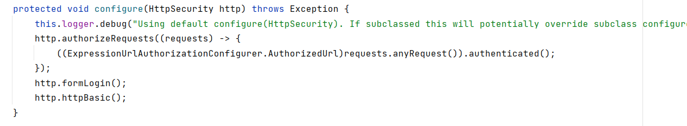
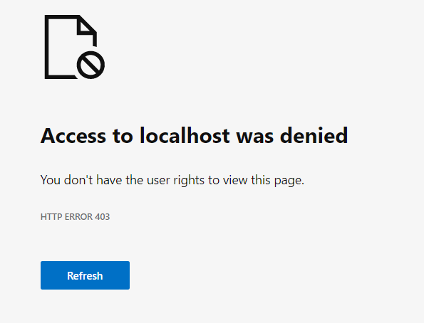

# Introduction to Spring Security

So far :

* Bean,
* Autowiring,
* Dependency Injection,
* AOP,
* Spring MVC Pattern.

Now:

* Spring Security

Our Web Application is so far Publicly Accessible.

Requirement :

1. Build a dynamic Web- Application for a School.
2. Integrate Login Functionality.
3. User should be able to log in their Dashboard.
4. Roles Support: Student, Teacher, Admin, etc.
5. Based on the roles, the content should be displayed in the dashboard.
6. Public/Unauthorised users can be able to use static pages of the website.

In order to secure the Application inside Spring Framework, they have created a Project called "Spring Security".
https://spring.io/projects/spring-security

By writing just very less code, we can control, which user can access which data or classes or URLs.

* Authorisation and Authentication Mechanism
* Protect from CSRF(Cross-Site Request Forgery).

# Spring Security

1. Spring Security is highly customizable authentication and access-control framework. It is the de-facto standard for
   security Spring-based applications.
2. Below is the maven dependency that we can add to implement security using Spring Security project in any of the
   SpringBoot Projects.

````
<dependency>
   <groupId>org.springframework.boot</groupId>
   <artifactId>spring-boot-starter-security</artifactId>
   <version>2.7.3</version>
</dependency>
````

4. Spring Security is a framework that provides authentication, authorization, and protection against common attacks.
5. Spring Security helps developers with easier configurations to secure a web application by using standard
   username/password authentication mechanism.
6. Spring Security provides out of the box features to handle common security attacks like CSRF, CORs. It also has good
   integrations with security standards like JWT, OAUTH2 etc.

# Demo

1. Add dependency
2. Build and Run the application
3. Open Browser and go to localhost:8080, asking for username and password
4. Username : user Password : (see logs of application Startup)

## Setting your own Username and Passwords

1. Application.properties - (not the production standard, not recommend)
   ````
   spring.security.user.name= navi
   spring.security.user.password= 12345
   ````
   By default, the pages are secured inside our web application, and furthermore we are going to make it more specific.

## Understanding the default security settings

https://spring.io/blog/2022/02/21/spring-security-without-the-websecurityconfigureradapter
since websecurityconfigureradapter is deprecated.

1. class ``webConfigureSecuriyAdapter``
   <kbd>  </kbd>

2. here we are securing any type of url requests. ``(.anyrequest --> authenticate)``
3. ``.authenticated()`` method tells the spring mvc to authenticate the particular request.
4. ``.anyRequest()`` since we are using anyRequest(), spring mvc will perform authentication on all the requests by
   default.
5. ``http.formLogin()`` provides support for username and password being provided through a html form.
6. ``http.httpBasic()`` Auth using HTTP header in order to provide the username and password when making the request to
   the server.
7. In order to override the current default configurations we need to import this class and override this method.

## Overriding the default behavior of the Application.

### Making all the pages Public

1. Using ``permitAll()`` configurations, we can allow full/public access to a specific resource/path or all the
   resources/paths inside a web application.
2. Create a new Class extend ``WebSecurityConfigurerAdapter`` and override the configure method.

````java

@Controller
public class ProjectSecurityConfig extends WebSecurityConfigurerAdapter {

    protected void configure(HttpSecurity http) throws Exception {
        //Permit all the requests inside the web-application

        http.authorizeRequests()
                .anyRequest().permitAll()
                .and().formLogin()
                .and().httpBasic();
    }
````

### Denying all the requests.

````java
protected void configure(HttpSecurity http)throws Exception{
        //Permit all the requests inside the web-application

        http.authorizeRequests()
        .anyRequest().denyAll()
        .and().formLogin()
        .and().httpBasic();
        }
        }
````

note: In the case of denyAll(), Spring will ask for credentials and even after putting right credentials, it will still
deny to show the page. Because, a user is authenticated but not authorised to view this particular page or in the above
case we are not authorised to see any page on our web application since we have denied all the requests.

403 means not authorised. In contrast to PermitAll, where we permit all the requests and then spring won't ask
authorisation.

## Updates

From Spring Security 5.7, the `WebSecurityConfigurerAdapter` is deprecated to encourage users to move towards a
component-based security configuration. It is recommended to create a bean of type `SecurityFilterChain` for security
related configurations.

````java

@Configuration
public class ProjectSecurityConfig  /*extends WebSecurityConfigurerAdapter*/ {

    /*@Override
    protected void configure(HttpSecurity http) throws Exception {

        // Permit All Requests inside the Web Application
        http.authorizeRequests().
                    anyRequest().permitAll().
                    and().formLogin()
                    .and().httpBasic();

        // Deny All Requests inside the Web Application
        *//*http.authorizeRequests().
                anyRequest().denyAll().
                and().formLogin()
                .and().httpBasic();*//*
    }*/

    /**
     * From Spring Security 5.7, the WebSecurityConfigurerAdapter is deprecated to encourage users
     * to move towards a component-based security configuration. It is recommended to create a bean
     * of type SecurityFilterChain for security related configurations.
     * @param http
     * @return SecurityFilterChain
    //* @throws Exception
     */
    @Bean
    SecurityFilterChain defaultSecurityFilterChain(HttpSecurity http) throws Exception {

        // Permit All Requests inside the Web Application
        http.authorizeRequests().anyRequest().permitAll().
                and().formLogin()
                .and().httpBasic();

        // Deny All Requests inside the Web Application
            /*http.authorizeRequests().anyRequest().denyAll().
                    and().formLogin()
                    .and().httpBasic();*/

        return http.build();

    }
````

## Configure Custom Security  Configurations

So far, we have three options-

1. Default behaviour i.e. Protecting all or configuring user credentials in application.properties
2. Permitting all the requests
3. Denying all the requests

- We can apply custom security configurations based on our requirements for each API/URL like below.
- permitAll() can be used to allow access w/o security and authenticated() can be used to protect a web page/API.
- By default, any request with HTTP methods that can update data like POST, PUT will be stopped with 403 error die to
  CSRF protection. We can disable the same for now and enable in the coming changes when we started generating CSRF
  tokens.
- Below is the simple configuration that we can deo to implement custom security configs and disable CSRF.

Again we are overriding the method called ``configure``
We use

````java

@Controller
public class ProjectSecurityConfig {
    /**
     * From Spring Security 5.7, the WebSecurityConfigurerAdapter is deprecated to encourage users
     * to move towards a component-based security configuration. It is recommended to create a bean
     * of type SecurityFilterChain for security related configurations.
     //* @param http
     // * @return SecurityFilterChain
     //* @throws Exception
     */

    @Bean
    SecurityFilterChain defaultSecurityFilterChain(HttpSecurity http) throws Exception {
        http.csrf().disable()
                .authorizeRequests()
                .mvcMatchers("/home").permitAll()
                .mvcMatchers("/holidays/**").permitAll()
                .mvcMatchers("/contact").permitAll()
                .mvcMatchers("/saveMsg").permitAll()
                .mvcMatchers("/courses").authenticated()
                .mvcMatchers("/about").permitAll()
                .and().formLogin().and().httpBasic();
        return http.build();
    }
````

Also, Spring Security offers three types of matchers methods to configure endpoints security,

1. MVC Matchers
2. Ant Matchers
3. Regex Matchers

## Matcher Methods in Spring Security

Key points of matcher methods:  <br>

<h4> MVC matchers : </h4>

1. `mvcMatcher()` uses Spring MVC's HandleMappingIntrospector to match the path and extract variables.
2. `mvcMatcher(HttpMethod method, String..patterns)`. We can specify both the HTTP method and path pattern to configure
   restrictions.
3. `mvcMatchers(String..patterns)`, We can specify only path pattern to configure restrictions and tell the HTTP methods
   will be allowed.

<h4> ANT matchers : </h4>

1. antMatters() is an implimentation anti style path patterns. Below are the supported methods around it.
    * `antMatchers(HttpMethod method, String..Patterns)`
    * `antMatchers(String..Patterns)`
    * `antMatchers(HttpMethod method)`
2. Generally mvcMatchers is more secure that an antMatcher. As an example
    + `antMatchers("/secured")` matches only the exact / secured URL
    + `mvcMatchers("/secured")`matches `/secured` as well as `/secured/` , `/secured.html`, `/secured.xzy`.

<h4> Regex matchers :</h4>

1. Regexes can be used to match any format of string pattern, so they offer unlimited possibilities for this matter.
2. `regexMatchers(HttpMethod method, String regex)` - we can specify both HTTP method and path regex to configure
   restrictions.
3. `regexMatchers(String regex)` - we can specify only path regex to configure restrictions and all the HTTP methods
   will
   be allowed.

````java

@Bean
    SecurityFilterChain defaultSecurityFilterChain(HttpSecurity http)throws Exception{
            http.csrf().disable()           // Also disabling the CSRF security 
            .authorizeRequests()
            .mvcMatchers("/home").permitAll()
            .mvcMatchers("/holidays/**").permitAll()
            .mvcMatchers("/contact").permitAll()
            .mvcMatchers("/saveMsg").permitAll()
            .mvcMatchers("/courses").permitAll()
            .mvcMatchers("/about").permitAll()
            .and().formLogin().and().httpBasic();
            return http.build();
            } 
````

# Configuring Multiple Users using inMemoryAuthentication()

https://www.marcobehler.com/guides/spring-security

In ``ProjectSecurityConfig`` class -->

````java
 @Bean
public InMemoryUserDetailsManager userDetailsService(){

        UserDetails admin=User.withDefaultPasswordEncoder()
        .username("user")
        .password("12345")
        .roles("USER")
        .build();
        UserDetails user=User.withDefaultPasswordEncoder()
        .username("admin")
        .password("54321")
        .roles("USER","ADMIN")
        .build();
        return new InMemoryUserDetailsManager(user,admin);
        }
````

## Making our own custom login page

``and().formLogin().loginPage("/login")//mapping to your own login page
.defaultSuccessUrl("/dashboard")// fwd to dashboard after successful logging``

````java
@Bean
    SecurityFilterChain defaultSecurityFilterChain(HttpSecurity http)throws Exception{
            http.csrf().disable()
            .authorizeRequests()
            .mvcMatchers("/dashboard").authenticated() //always secure the dashboard
            .mvcMatchers("/home").permitAll()
            .mvcMatchers("/holidays/**").permitAll()
            .mvcMatchers("/contact").permitAll()
            .mvcMatchers("/saveMsg").permitAll()
            .mvcMatchers("/courses").permitAll()
            .mvcMatchers("/about").permitAll()
            .mvcMatchers("/login").permitAll() //login page should be seen by all
            .and().formLogin().loginPage("/login")//mapping to your own login page
            .defaultSuccessUrl("/dashboard")// fwd to dashboard after successful logging
            .failureUrl("/login?error=true").permitAll()
            .and().logout().logoutSuccessUrl("/logout?logout=true")
            .invalidateHttpSession(true).permitAll()
            .and().httpBasic();
            return http.build();
            }
````

````java

@Slf4j
@Controller
public class LoginController {

    @RequestMapping(value = "/login", method = {RequestMethod.GET, RequestMethod.POST})
    public String displayLoginPage(@RequestParam(value = "error", required = false) String error,
                                   @RequestParam(value = "logout", required = false) String logout, Model model) {
        String errorMessge = null;
        if (error != null) {
            errorMessge = "Username or Password is incorrect !!";
        }
        if (logout != null) {
            errorMessge = "You have been successfully logged out !!";
        }
        model.addAttribute("errorMessge", errorMessge);
        return "login.html";
    }

    @RequestMapping(value = "/logout", method = RequestMethod.GET)
    public String logoutPage(HttpServletRequest request, HttpServletResponse response) {
        Authentication auth = SecurityContextHolder.getContext().getAuthentication();
        if (auth != null) {
            new SecurityContextLogoutHandler().logout(request, response, auth);
        }
        return "redirect:/login?logout=true";
    }
}
````

## Exception Handling using @ControllerAdvice and @ExceptionHandler annotations

In order to hide the technical errors to the end-users we make a custom error page.

+ ``@ControllerAdvice`` is specialization of ``@Component`` annotation, which allows to handle exceptions across the
  whole application in one global handling component. You can think of it as an interceptor of exception thrown by
  methods annotated with ``@RequestMapping``, etc.
+ We can define the exception handle logic inside a method and annotate it with
+ You can handle eny type of exceptions, but you have to mention it in the parenthesis. i.e. ``Exception.class`` which
  is parent of all the exceptions.
+ Below is the code.

````java

@Slf4j
@ControllerAdvice
public class GlobalExceptionsController {
    public ModelAndView exceptionHandler(Exception exception) {
        ModelAndView errorPage = new ModelAndView();
        errorPage.setViewName("error");
        errorPage.addObject("errorMsg", exception.getMessage());
        return errorPage;
    }
````

````thymeleafexpressions
<p th:text="${'Error Message - ' + errormsg}"></p>
<a th:href="@{/home}">Go to Home</a>
````

## CSRF


