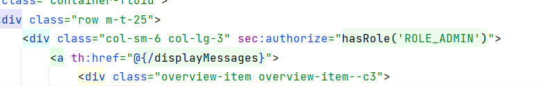

# Databases

1. JDBC
2. JDBC Template
3. H2
4. Connection and CRUD Operation

# JDBC

1. Add dependencies

````xml

<dependency>
    <groupId>org.springframework.boot</groupId>
    <artifactId>spring-boot-starter-jdbc</artifactId>
</dependency>
````

# JDBC Template

* Reduces errors and handles -
    * Creating the connection.
    * Maintaining the connection.
    * Closing the connection.
    * Creating the Statement Object
    * Avoiding the common errors
* Getting started (**optional with SpringBoot, with SpringBoot- define - inside application.properties**)
  Creating the bean of JDBC Template - This bean can be used in all the repo classes, and can perform database
  operations by invoking various methods available inside this JDBC Template.
    1. Creating the bean of type ``DataSource`` of JDBC Data Source. This provides the database connection to my
       application.
    2. Inside any Repository/DAO classes we want to execute the queries, we need to create a bean/object
       of ``jdbcTemplate`` by injecting the ``dataSource`` bean.
    3. Start doing the operations like the code below.

* some methods()
    * `this.jdbcTemplate`
        * `.queryForObject("query", return_type, anyReqPara)`
        * `.update("query")`  //can also be used for stored procedures
        * `.execute("query")`

# H2

### Setting UP

1. dependencies

````xml

<dependency>
    <groupId>com.h2database</groupId>
    <artifactId>h2</artifactId>
    <scope>runtime</scope>
</dependency>
<dependency>
<groupId>org.springframework.boot</groupId>
<artifactId>spring-boot-starter-jdbc</artifactId>
</dependency>
````

2. Properties of H2 database inside application.properties

````
spring.datasource.url=jdbc:h2:mem:testdb
spring.datasource.driverClassName=org.h2.Driver
spring.datasource.username=sa
spring.datasource.password=
spring.jpa.database-platform=org.hibernate.dialect.H2Dialect
spring.h2.console.enabled=true
spring.jpa.hibernate.ddl-auto=update
spring.jpa.show-sql=true
````

3. Table creation scripts inside resources folder

````mysql
CREATE TABLE IF NOT EXISTS `contact_msg`
(
    `contact_id` int AUTO_INCREMENT PRIMARY KEY,
    `name`       varchar(100) NOT NULL,
    `mobile_num` varchar(10)  NOT NULL,
    `email`      varchar(100) NOT NULL,
    `subject`    varchar(100) NOT NULL,
    `message`    varchar(500) NOT NULL,
    `status`     varchar(10)  NOT NULL,
    `created_at` TIMESTAMP    NOT NULL,
    `created_by` varchar(50)  NOT NULL,
    `updated_at` TIMESTAMP   DEFAULT NULL,
    `updated_by` varchar(50) DEFAULT NULL
);
````

# Connection and CRUD Operation

1. Data present inside your database table has to be converted into pojo class. So, we have to make sure that our pojo
   classes are in sync with our database tables. Let's check our model class of ``contect`` and add the required fields.
2. Create a new package ``repositories``, add a repo class for Contact i.e. ``contactRepo`` and add the method to save
   message coming from controller layer. Here, ``jdbcTemplate`` is autowired at constructor, and it is autoconfigured.

````java

@Repository
public class ContactRepository {
    private final JdbcTemplate jdbcTemplate;

    @Autowired
    public ContactRepository(JdbcTemplate jdbcTemplate) {
        this.jdbcTemplate = jdbcTemplate;
    }

    public int saveContactMsg(Contact contact) {
        String sql = "INSERT INTO CONTACT_MSG(NAME,MOBILENUM,EMAIL,SUBJECT,MESSAGE,STATUS,CREATED_AT,CREATED_BY) " +
                "VALUES(?,?,?,?,?,?,?,?)";
        return jdbcTemplate.update(sql, contact.getName(), contact.getMobileNum(), contact.getEmail(),
                contact.getSubject(), contact.getMessage(), contact.getStatus(), contact.getCreatedAt(),
                contact.getCreatedBy());
    }
}
````

3. From our service layer we need to invoke the repo. For that we need to inject ``contactRepo`` bean
   to ``ContactService`` constructor.

````java

@Slf4j
@Service
public class ContactService {
    private final ContactRepository contactRepository;


    @Autowired
    public ContactService(ContactRepository contactRepository) {
        this.contactRepository = contactRepository;
    }

    public boolean saveMessageDetails(Contact contact) {
        boolean isSaved = true;
        //TODO - Need to persist the data into the DB table
        contact.setStatus(ModelSchoolConstants.OPEN);
        contact.setCreatedBy(ModelSchoolConstants.ANONYMOUS);
        contact.setCreatedAt(LocalDateTime.now());
        int results = contactRepository.saveContactMsg(contact);
        if (results > 0) {
            isSaved = true;
        }
        return isSaved;
    }
}

````

4. Finally, calling ``saveMessageDetails()`` method from the controller class.

````java
 @PostMapping(value = "/saveMsg")
public String saveMessage(@Valid @ModelAttribute("contact") Contact contact,Errors errors){  //How the fuck, this method knows about the variable coming from UI.
        if(errors.hasErrors()){
        log.error("Contact form validation failed due to: "+errors.toString());
        return"contact.html"; //This is not the new fresh page but the same page, where user was typing the information.
        }
        contactService.saveMessageDetails(contact);
        return"redirect:/contact"; // This is new page shown when the form is submitter correctly.
        }
````

# Display Contact Message from DB using JDBC Template

1. Front End changes
   
   This message div has only ot be shown to the users who have admin access.
   ``sec:authorize="hasRole('ROLE_ADMIN')``
   Update css classes.

2. Back End changes
    + Updating path ``/displayMessages``

````java
@RequestMapping("/displayMessages")
public ModelAndView displayMessages(Model model){
        List<Contact> contactMsgs=contactService.findMsgWithOpenStatus();
        ModelAndView modelAndView=new ModelAndView("messages.html");
        modelAndView.addObject("contactMsgs",contactMsgs);
        return modelAndView;
        }
`````

+ Add new html called ``contactMsgs`` to front end
  we have a table to show the data

````thymeleafexpressions
<tr>
<th scope="col">Name</th>
    <th scope="col">Mobile Num</th>
    <th scope="col">Email</th>
    <th scope="col">Subject</th>
    <th scope="col">Message</th>
    <th scope="col"></th>
</tr>
````

Then, we have th:each for iterating over the list of objects we are getting from the backend and with their respective
fields, and with the ``close`` button the admin will have the ability to close the messages. ``back`` button will take
us back to the dashboard.

````thymeleafexpressions
<tr th:each="msg: ${contactMsgs}">  <!-- iterating over list of contact messages  -->
    <td th:text="${msg.name}"></td> // <!-- getting the fields from the contactMsgs Object-->
    <td th:text="${msg.mobileNum}"></td>
    <td th:text="${msg.email}"></td>
    <td th:text="${msg.subject}"></td>
    <td th:text="${msg.message}"></td>
    <td><a th:href="@{/closeMsg(id=${msg.contactId})}" class="btn btn-style btn-style-3">CLOSE</a></td>
</tr>
<div class="col-md-2 login-center text-start">
        <a th:href="@{/dashboard}">
        <button class="btn btn-style btn-style-3 text-left">BACK</button>
        </a>
    </div>
````

+ Create ``findMsgWithOpenStatus()`` method to get the data from the database in the ``ContactService`` class.

````java
public List<Contact> findMsgWithOpenStatus(){
        List<Contact> contactMsgs=contactRepository.findMsgsWithStatus(ModelSchoolConstants.OPEN);
        return contactMsgs;
        }
````

+ Create ``findMsgsWithStatus(ModelSchoolConstants.OPEN)`` in ``ContactRepository`` class. Method will accept ``status``
  .
    - Here we are using ``jdbcTemplate.query()`` to get the list of Objects from the db.
    - In this method, our first parameter will be simple 'sql'.
    - The second is Prepared Statements
        - Prepared statements have some question marks in the query which we have to populate, by the following code we
          are doing that.

```````java
new PreparedStatementSetter(){
public void setValues(PreparedStatement preparedStatement)throws SQLException{
        preparedStatement.setString(1,status);
        }
```````

- The third parameter will be **RowMapper**: to map all the values we are getting from the query to the POJO class
  fields.
    - Next to Next is the full code explanation of the RowMappers.

Below is the full method in one snippet.

````java
public List<Contact> findMsgsWithStatus(String status){
        String sql="SELECT * FROM CONTACT_MSG WHERE STATUS = ?";
        return jdbcTemplate.query(sql,new PreparedStatementSetter(){
public void setValues(PreparedStatement preparedStatement)throws SQLException{
        preparedStatement.setString(1,status);
        }
        },new ContactRowMapper());
        }
````

### RowMappers

+ RowMapper is an interface, which allows to map a row of the relation with the instance of user-defined class. It
  iterated the ResultSet internally and adds it into the collection. So, we don't need to write a lot of ode to fetch
  the records as ResultSetExtractor.
+ RowMapper saves a lot of code because it internally adds the data of the ResultSet into the collection. 
+ It defines only one method ``mapRow`` the accepts ``ResultSet`` instance and ``int`` as parameter.

- implement ``RowMapper`` interface and pass the pojo class for the object ``\<Contact>``, and override a
  method ``mapRow()``.

````java
public class ContactRowMapper implements RowMapper<Contact> {

    @Override
    public Contact mapRow(ResultSet rs, int rowNum) throws SQLException {
        Contact contact = new Contact();
        contact.setContactId(rs.getInt("CONTACT_ID"));
        contact.setName(rs.getString("NAME"));
        contact.setMobileNum(rs.getString("MOBILE_NUM"));
        contact.setEmail(rs.getString("EMAIL"));
        contact.setSubject(rs.getString("SUBJECT"));
        contact.setMessage(rs.getString("MESSAGE"));
        contact.setStatus(rs.getString("STATUS"));
        contact.setCreatedAt(rs.getTimestamp("CREATED_AT").toLocalDateTime());
        contact.setCreatedBy(rs.getString("CREATED_BY"));

        if (null != rs.getTimestamp("UPDATED_AT")) {
            contact.setUpdatedAt(rs.getTimestamp("UPDATED_AT").toLocalDateTime());
        }
        contact.setUpdatedBy(rs.getString("UPDATED_BY"));
        return contact;
    }
}
````


