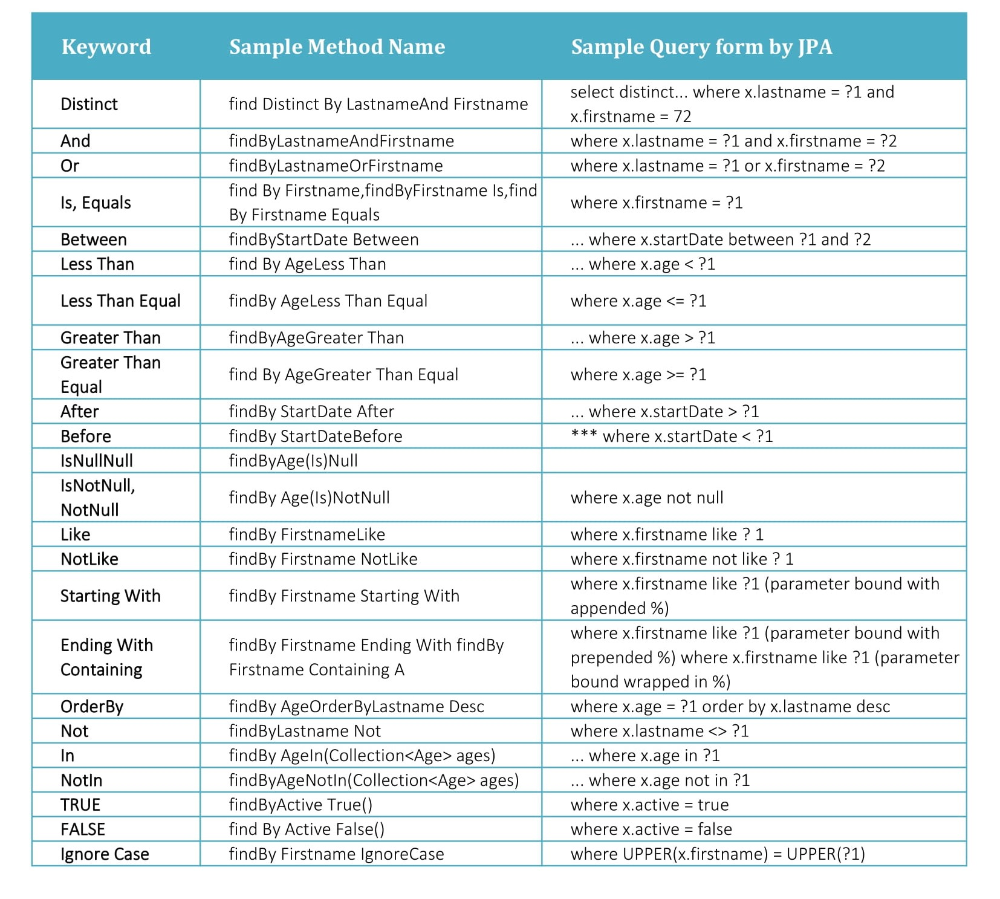

# Migrate from JDBCTemplate to Spring Data JPA

## Introduction to Spring Data

### Repository

### CrudRepository

### PagingAndSortingRepository

## Intro to Spring Data JPA

## Derived Query Methods Inside Spring Data JPA

1. Spring Data JPA has just 2-3 methods in CrudRepository interface, which finds the data in the database with the help
   of ID. However, if you have some custom requirements like to fetch the data by column Status, you can define your own
   Abstract methods in the Repository interface. We are deep diving in this topic the last of the file.

````java

@Repository
public interface ContactRepository extends CrudRepository<Contact, Integer> {

    // By the following line, we are letting Spring Data JPA know that, there is a field in the Contact POJO Class,
    //This Status corresponds to a colum inside my database table, so find the records based on the Status value which
    // being passed. Since, this method is returning the multiple rows of the contact_msg table -->
    // return type List<Contact>
    List<Contact> findByStatus(String status);

}
````

* Spring Data JPA is available to Spring Boot application with the JPA starter. This starter dependency is not only
  brings in Spring Data JPA, but also transitively includes Hibernate as the JPA implementation.
* Below is the maven dependency that we need to add to any SpringBoot projects in order to use Spring Data JPA.

````xml

<dependency>
    <groupId>org.springframework.boot</groupId>
    <artifactId>spring-boot-starter-data-jpa</artifactId>
</dependency>
````

* we need to follow steps in order to query a BD using Spring Data JPA inside the Spring Boot Application.

````java

````

+ Steps are as follows:
    1. We need to indicate java POJO class an entity class by using annotations like `@Entity`, `@Table`, `@Column`
        + This is how you make the relationship between table and the pojo class. If the name of Pojo Class and the
          table differ then also add an attribute
          as ``@Table(name= "contact_msg")``
        + Then, you have to make the relationship between fields of the pojo class and the columns of the table with the
          help of ``@Column`` annotation. Here also, you can use the name attribute like ``@Column(name="column_name")``
          if the names of fields differ from the names of the name of the columns in the table. If the names are same
          then we also don't need to put @Column annotation.
        + Primary key can be configured in pojo class using ``@Id`` annotation.
        + Id generation ``@GeneratedValue(strategy = GenerationType.AUTO, generator="native")``
          and ``@GenericGenerator(name="native", strategy = "native")``. This means that the primary key will be auto
          generated by the database.

````java

@Data
@Entity
@Table(name = "contact_msg")
public class Contact extends BaseEntity {
    @Id
    @GeneratedValue(strategy = GenerationType.AUTO, generator = "native")
    @GenericGenerator(name = "native", strategy = "native")
    @Column(name = "contact_id")
    private int contactId;  //since this data type is the primary key inside our table we are using int datatype.

    /**
     * @NotNull: Checks if a given field is not null but allows empty values & zero elements inside collections.
     * @NotEmpty: Checks if a given field is not null and its size/length is greater than zero.
     * @NotBlank: Checks if a given field is not null and trimmed length is greater than zero.
     */

    @NotBlank(message = "Name must not be blank")
    @Size(min = 3, message = "Name must be at least 3 characters long ")
    String name;


    @Column(name = "mobile_num")
    @NotBlank(message = "Mobile number must not be blank")
    @Pattern(regexp = "(^$|[0-9]{10})", message = "Mobile Number must be 10 digits")
    String mobileNum;


    @NotBlank(message = "Email Should not be blank")
    @Email(message = "Please provide a valid email")
    String email;


    @NotBlank(message = "Subject must not be blank")
    @Size(message = "Subject must be 5 characters long")
    String subject;


    @NotBlank(message = "Message must not be blank")
    @Size(message = "Message must be at least 10 characters long")
    String message;


    private String status;      //for status of the message
}
````

        + In cases where you have a POJO class which extends the parent class, you put ``@MappedSuperclass`` annotation
          which indicates to my Spring data JPA that all the entities in this parent class are also the part of the POJO
          class and part of the table. 

````java

@Data
@MappedSuperclass
public class BaseEntity {
    private LocalDateTime createdAt;
    private String createdBy;
    private LocalDateTime updatedAt;
    private String updatedBy;
}
````

    + In case of Enums, @Enumerated annotation must be used, in order to convert Type field data from enum data type to 
    String during the transections of JPA. 

````java

@Data
@Entity
@Table(name = "holidays")
public class Holiday extends BaseEntity {

    @Id
    public String day;

    public String reason;

    @Enumerated(EnumType.STRING)
    public Type type;

    public enum Type {
        FESTIVAL, FEDERAL
    }

}
````

    2. Create interfaces for a given table entity by extending the framework provided Repository interfaces. This helps
       us to run the basic CRUD operation on the table without writing the method implementations. _Note: Whenever we
       want to use the Spring Data features or Capabilities, we need to extend one of the interfaces available in the
       Spring Data JPA._ Here we are extending the CRUD repo from the Spring Database. So, this repo is responsible to
       interact with ``contact_msg`` table. Table details can be identified by Spring JPA based on the config we have
       done. Additionally, we also have to mention the data type of the Id we have in our table as well in the Contact
       POJO class. _Here in our case we have it of type int, and we are using integer data type from the Wrapper class
       i.e. Integer._ This is an empty interface, and we also add a stereotype annotation on the table
       dh ``@Repository``, and extending it to CrudRepository interface. _Note: We are extending the interface and not
       class, so we can not make a bean out of it, for that, our Spring Data JPA will create the implementations during
       the runtime, and it will create a bean for that. For that reason, we can use the bean that is created for the
       contact repo inside our code easily.

For Holidays Repo

````java

@Repository
public interface HolidaysRepository extends CrudRepository<Holiday, String> {


}
````

For Contact Repo

````java

@Repository
public interface ContactRepository extends CrudRepository<Contact, Integer> {
}
````

    3. Need to configure the Spring Boot by mentioning the packages of POJO class in the Controller classes and the repo
       class, which enables the JPA functionality and scanning by using the annotations ``@EnableJpaRepositories``(-> interface repos)
       and ``@EntityScan``(-> modal classes).

HolidaysController

````java

@Slf4j
@Controller
public class HolidaysController {

    @Autowired
    private HolidaysRepository holidaysRepository;

    @GetMapping("/holidays/{display}")
    public String displayHolidays(@PathVariable String display, Model model) {
        if (null != display && display.equals("all")) {
            model.addAttribute("festival", true);
            model.addAttribute("federal", true);
        } else if (null != display && display.equals("federal")) {
            model.addAttribute("federal", true);
        } else if (null != display && display.equals("festival")) {
            model.addAttribute("festival", true);
        }

        /**
         * FindAll() method will fetch all the data from the Table, Map all the rows and the columns to the fields
         * inside the Holiday POJO class based on the configurations we have done in the POJO class.
         * */


        //Return iterable of Holidays
        Iterable<Holiday> holidays = holidaysRepository.findAll();
        //Convert the Iterable to the list
        List<Holiday> holidaysList = StreamSupport.stream(holidays.spliterator(), false)
                .collect(Collectors.toList());

        Holiday.Type[] types = Holiday.Type.values();
        for (Holiday.Type type : types) {
            model.addAttribute(type.toString(),
                    (holidaysList.stream().filter(holiday -> holiday.getType().equals(type)).collect(Collectors.toList())));
        }
        return "holidays.html";
    }
}

````

Contact Controller is same

````java

@Controller
public class ContactController {
    private static Logger log = LoggerFactory.getLogger(ContactController.class);

    private final ContactService contactService;

    @Autowired
    public ContactController(ContactService contactService) {
        this.contactService = contactService;
    }

    @RequestMapping("/contact")
    public String displayContactPage(Model model) {
        model.addAttribute("contact", new Contact());
        return "contact.html"; // this contact.html referring to the same page not the fresh contact page.
    }

    @PostMapping(value = "/saveMsg")
    public String saveMessage(@Valid @ModelAttribute("contact") Contact contact, Errors errors) {  //How the fuck, this method knows about the variable coming from UI.
        if (errors.hasErrors()) {
            log.error("Contact form validation failed due to: " + errors.toString());
            return "contact.html"; //This is not the new fresh page but the same page, where user was typing the information.
        }
        contactService.saveMessageDetails(contact);
        return "redirect:/contact"; // This is new page shown when the form is submitter correctly.
    }

    @RequestMapping("/displayMessages")
    public ModelAndView displayMessages(Model model) {
        List<Contact> contactMsgs = contactService.findMsgWithOpenStatus();
        ModelAndView modelAndView = new ModelAndView("messages.html");
        modelAndView.addObject("contactMsgs", contactMsgs);
        return modelAndView;
    }

    @RequestMapping(value = "/closeMsg", method = RequestMethod.GET)
    public String closeMessage(@RequestParam int id, Authentication authentication) {
        contactService.updateMsgStatus(id, authentication.getName());
        return "redirect:/displayMessages";
    }
}

````

Contact Service Class

````java

@Slf4j
@Service

public class ContactService {
    private final ContactRepository contactRepository;


    @Autowired
    public ContactService(ContactRepository contactRepository) {
        this.contactRepository = contactRepository;
    }

    public boolean saveMessageDetails(Contact contact) {
        boolean isSaved = true;

        contact.setStatus(ModelSchoolConstants.OPEN);
        contact.setCreatedBy(ModelSchoolConstants.ANONYMOUS);
        contact.setCreatedAt(LocalDateTime.now());

        //Return type from the save method is Pojo class object along with Primary key, which is created and stored into
        // the database. This is the create operation with repo(crud).save() method.
        Contact saveContact = contactRepository.save(contact);

        //checking if the value is saved
        if (null != saveContact && saveContact.getContactId() > 0)
            isSaved = true;

        return isSaved;
    }

    public List<Contact> findMsgWithOpenStatus() {
        //Using derived query method "findByStatus()" to get all the rows with open status.
        List<Contact> contactMsgs = contactRepository.findByStatus(ModelSchoolConstants.OPEN);
        return contactMsgs;
    }

    public boolean updateMsgStatus(int contactId, String updatedBy) {

        Boolean isUpdated = false;
        //fetching the contact from the database according to id provided
        // contactRepository.findById(contactId) returns the POJO, if the data is not present inside the database it
        // will return null, this is the reason we have Optional of Contact.
        Optional<Contact> contact = contactRepository.findById(contactId);

        //if contact Object is present(id) modify this retrieved object
        // lambda expression population with values to be modified
        contact.ifPresent(contact1 -> {
            contact1.setStatus(ModelSchoolConstants.CLOSE);
            contact1.setUpdatedBy(updatedBy);
            contact1.setUpdatedAt(LocalDateTime.now());
        });

        //saving the modified value
        //contact.get() --> since Contact object:contact is an optional, we have to call this method
        Contact updatedContactObject = contactRepository.save(contact.get());


        if (null != updatedContactObject && updatedContactObject.getUpdatedBy() != null) {
            isUpdated = true;
        }
        return isUpdated;
    }
}

````

    4. Inject Repo bean into any collector service classes and execute the required DB operations.

       _Note:The Object of the Contact Pojo class is taken as a parameter for the CruRepo method and if there is just
       this object, it is understood by the JPA that this object has to be saved while generating the ID, but if we pass
       and id with the object, it will modify it, understanding that the id must be already present in the Table._

````java

@SpringBootApplication
@EnableJpaRepositories("com.navi.modelSchool.repository")
@EntityScan("com.navi.modelSchool.model")
public class SchoolWebsite {

    public static void main(String[] args) {
        SpringApplication.run(SchoolWebsite.class, args);
    }
}
````

#### Show Sql

Adding a property inside application.properties file

+ To show sql
  ``spring.jpa.show-sql=true``

+ Proper formatting
  ``spring.jpa.properties.hibernate.format_sql=true``

## Deep Dive into Derived Queries

Do you know a derived query method name has two main components separated by the first By keyword.

1. The ``introducer`` clause like ``find``, ``read``, ``query``, ``count``, or ``get`` which tells Spring Data JPA what
   you want to do with the method. This clause can contain further expressions, such as ``Distinct`` to set a distinct
   flag on the query to be created.
2. The ``criteria`` clause that starts after the first By keyword. The first acts as a delimiter to indicate the start
   of the actual query criteria. The criteria clause is where you define conditions on entity properties and concatenate
   them with ``And`` and ``Or`` keywords.
3. _Using readBy, getBy, and queryBy in place of findBy will behave the same. For example, readBy Email(String
   email) is same as findByEmail(String email)._

**Supported Keywords inside method names**
