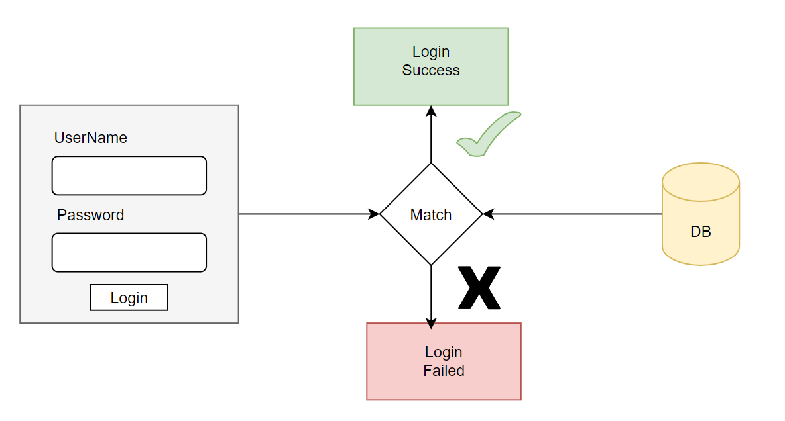
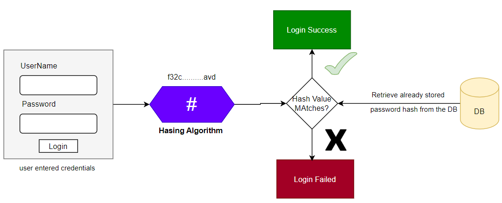

# Authentication with credentials in DB using JPA

Aim is to perform the login check against a db table or any other secure system.

1. Spring Security allows us to write our own custom logic to authenticate a user based on our requirements by
   implementing ``AuthenticationProvider`` interface. For that we have created a new Class
   called ``ModelSchoolUsernamePwdAuthenticationProvider``

````java

@Component //making bean of this java class
public class ModelSchoolUsernamePwdAuthenticationProvider implements AuthenticationProvider {

    @Autowired
    private PersonRepository personRepository; // to check the credentials from the DB


    /*
    Authentication authenticate() method for our own custom logic.
     */
    @Override
    public Authentication authenticate(Authentication authentication) throws AuthenticationException {
        String email = authentication.getName(); //Authentication is the object from the User LogIn page : here we are getting an Email from that authentication method
        String pwd = authentication.getCredentials().toString();
        Person person = personRepository.readByEmail(email); //getting person object by providing the email, readByEmail: Derived by Query in Person Repo


        /*logic for comparing Credentials from the user with Credentials present in the DB
        check for if we have got the person object by the email we have provided.
        Check if the id of that person is greater than 0
        Check if the passwords are matching.
        if ja:
            return the UserPasswordAuthenticationToken --> Parameters: Name, Password, and Granted Authorities(Role)
            Granted Authorities(Role) of  'Collection<? extends GrantedAuthority> authorities' type, List because it can
            accept multiple roles.
        If no:
            throwing an exception : BadCredentialsException : "Invalid Credentials"
         */
        if (null != person && person.getPersonId() > 0 && pwd.equals(person.getPwd())) {
            return new UsernamePasswordAuthenticationToken(person.getName(), pwd, getGrantedAuthorities(person.getRoles()));
        } else {
            throw new BadCredentialsException("Invalid Credentials");
        }
    }


    // getting the information about the Roles and giving to Authentication object in a way that Spring Security can understand.
    // Roles parameters are the roles from the database and referenced to Roles POJO class
    private List<GrantedAuthority> getGrantedAuthorities(Roles roles) {
        List<GrantedAuthority> grantedAuthorities = new ArrayList<>();
        // Simple Granted Authority
        grantedAuthorities.add(new SimpleGrantedAuthority("Role_" + roles.getRoleName())); //Methods from the Roles class
        return grantedAuthorities;
    }

    @Override
    public boolean supports(Class<?> authentication) {
        //checking weather given authentication type object is of same data type UsernamePasswordAuthenticationToken?
        // if it is same, then only Spring Security will try to execute our business logic, that we have written in our
        // authenticate method above.
        return authentication.equals(UsernamePasswordAuthenticationToken.class);
    }
}
````

2. Once the AuthenticationProvider implementation is complete, we can inject it into the Spring Security main
   class (``ProjectSecurityConfig``) where we define the security requirements. (If we use SpringBoot, then we don't
   need to mention the ``@EnableWebSecurity`` annotation and also the bean of   ``AuthenticationProvider``
   implementation will be autoconfigured and injected without the need of doing it manually.) Since, we are
   authentication users against DB we can remove (if any) code related to ``InMemoryUserDetailsManager``.

3. All what we have done was checking passwords against the db which are stored in plain text in the database without
   encoding or encrypting bit it has integrity and confidentiality issues. Not recommended.
   

# Password Management

### Encoding

1. Encoding is defined as the process of converting data from one form to another and has nothing to do with
   cryptography.
2. It involves no secret and can be reversible.
3. Encoding can't be used for securing the data, there are various publicly available algorithms used for encoding e.g.
   ASCII, BASE64, UNICODE.

## Encryption

1. Encryption is defined as the process of transforming data in such a way that guarantees confidentiality.
2. To achieve confidentiality, encryption required to use of something secret called "key".
3. Encryption can be reversible by decryption with the help of "key", as long as the key is confidential, encryption can
   be considered as secure.

## Hashing

1. In Hashing the data is converted to the hash value using some hashing function.
2. Once the data is hashed, it's irreversible. ONe can not determine the original data from the hash value generated.
3. Given some arbitrary data along with the output of hashing algorithm, one can verify weather the data matches the
   original input data without needing to see the original data.

#### Note:-

Spring Security provide various ``PasswordEncoders`` to help developers with hashing of the secured data password.
Different Implementations of the PasswordEncoders provided by the Spring are:-

1. NoOpPasswordEncoder (No hashing, stored in plain text)
2. StandardPasswordEncoder
3. Pbkdf2PasswordEncoder
4. BCryptPasswordEncoder (Most Commonly Used)
5. SCryptPasswordEncoder

## Password Validation with Hashing and PasswordEncoder, flow diagram




