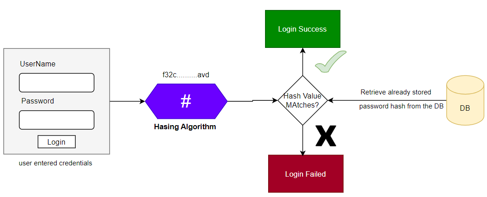

As we have how to save passwords in the plain text in Example 38. In this Module we are going to save passwords using
other password saving techniques.

# Password Management

### Encoding

1. Encoding is defined as the process of converting data from one form to another and has nothing to do with
   cryptography.
2. It involves no secret and can be reversible.
3. Encoding can't be used for securing the data, there are various publicly available algorithms used for encoding e.g.
   ASCII, BASE64, UNICODE.

## Encryption

1. Encryption is defined as the process of transforming data in such a way that guarantees confidentiality.
2. To achieve confidentiality, encryption required to use of something secret called "key".
3. Encryption can be reversible by decryption with the help of "key", as long as the key is confidential, encryption can
   be considered as secure.

## Hashing

Note: There could be many hashed values for the same password and all of them can confirm weather the password is
correct or not. Eg.<br>
``plaintext123`` --> ``$2a$12$VKStSJ7PSwrBkBLgg.3O/uK5eF6a4hKC/tNVYjP8YNcSqVguoaq6.`` <br>
``plaintext123`` --> ``$2a$12$aWYbCdHliWaD8leF/PUwEOXgCf3TLD73DQv5v1NX4BokXXR.5khgu`` <br>
``plaintext123`` --> ``$2a$12$pYrohnl0ABQVRcUUp8ZbFO6TWSv.yfFf0XE3cmHiyLE4X4oYmCjO.`` <br>
source: https://bcrypt-generator.com/  <br>

So, all these values can authenticate the password '``plaintext123``'. <br>

This makes hashing more secure that even after watching the hashed code form the database, we still can't figure out the
password.

1. In Hashing the data is converted to the hash value using some hashing function.
2. Once the data is hashed, it's irreversible. ONe can not determine the original data from the hash value generated.
3. Given some arbitrary data along with the output of hashing algorithm, one can verify weather the data matches the
   original input data without needing to see the original data.

#### Note:-

Spring Security provide various ``PasswordEncoders`` to help developers with hashing of the secured data password.
Different Implementations of the PasswordEncoders provided by the Spring are:-

1. NoOpPasswordEncoder (No hashing, stored in plain text)
2. StandardPasswordEncoder
3. Pbkdf2PasswordEncoder
4. BCryptPasswordEncoder (Most Commonly Used)
5. SCryptPasswordEncoder

## Password Validation with Hashing and PasswordEncoder, flow diagram



# Implementations

1. Create a bean got BCryptPasswordEncoder inside the ``ProjectConfig`` Class.

````java
 @Bean
public PasswordEncoder passwordEncoder(){
        return new BCryptPasswordEncoder(); //In order to achieve loose coupling 
        }
````

2. For now, we are saving the plain text values, but from now we are going to save Hashed values inside our DB.
   PersonService -->

````java

@Service
public class PersonService {
    @Autowired
    private PersonRepository personRepository;
    @Autowired
    private RolesRepository rolesRepository;
    @Autowired
    private PasswordEncoder passwordEncoder;

    public boolean createNewPerson(Person person) {
        boolean isSaved = false;
        Roles role = rolesRepository.getByRoleName(ModelSchoolConstants.STUDENT_ROLE); // Role from the DB or its entity
        person.setRoles(role);      // Get the person object and assign the role
        person.setPwd(passwordEncoder.encode(person.getPwd())); //getting the plain text password from the object and decoding it.
        person = personRepository.save(person);  // saving the data and hashed password. 
        // if saved return true
        if (null != person && person.getPersonId() > 0) {
            isSaved = true;
        }
        return isSaved;
    }
````

3. Login Configurations, getting the password from the user, hashing it with the Password Encoder, which is
   BCryptPasswordEncoder in our case and checking the hashed values inside our DB against the hashed value from the
   password of the user. Class ``ModelSchoolUsernamePwdAuthenticationProvider``

````java

````


