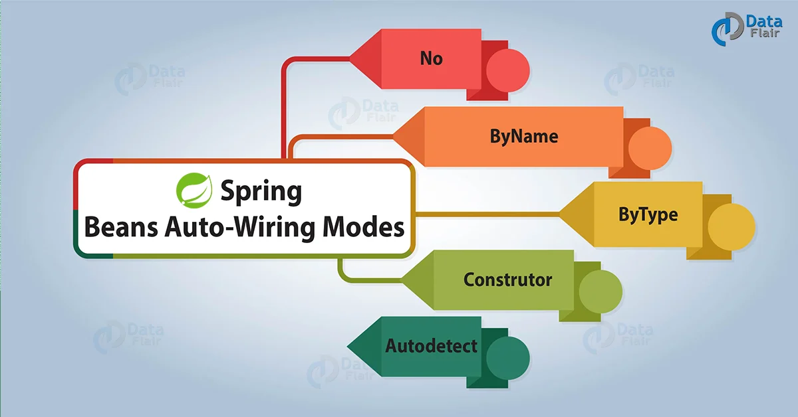
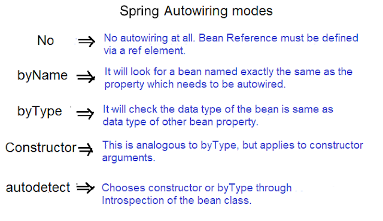

# Introduction to bean wiring inside the spring

source: https://data-flair.training/blogs/spring-beans-autowiring/

- Inside java web applications,usually the object delegate certain responsibilities to the other objects.
  So, in this scenario, objects will have dependency on others.
- In a very similar lines, when we create various beans using Spring, it is our responsibility to understand
  the dependencies that bean have and wire them. The concept inside called
  <span style="color:red"> Wiring/Autowiring</span>

### No wiring scenario inside spring

<p>Consider a scenario where we have two java classes Person and Vehicle. The Person class has dependency on
the Vehicle. Based on the belo code, we are only creating the bean inside the SPringcontext
and no wiring will be done. Due to this both beans present inside the Spring Context
with out knowing abot each other. 
</p>

````java
public class Vehicle {
    private String name;
}
````

````java
public class Person {
    private String name;
    private Vehicle vehicle;
}
````

````java
import org.springframework.context.annotation.Bean;

@Bean
public Vehicle vehicle(){
        Vehicle vehicle=new Vehicle();
        vehicle.setName("Toyota");
        return vehicle;
        }
@Bean
public Person person(){
        Person person=nre Person();
        person.setName("Lucy");
        return person;
        }
````


### Wiring Beans using <span style="color:red">Method Calls</span>

- Here in the belo code, we are trying to wire or establish a relationship between a person and Vehicle, by invoking the
  vehicle() bean method from peron() bean method. Now inside Spring Context, person owns the vehicle.
- Spring will make sure to have only 1 vehicle bean is created and also vehicle bean will be created first always as
  person bean has dependency on it.

````java
import org.springframework.context.annotation.Bean;

@Bean
public Vehicle vehicle(){
        Vehicle vehicle=new Vehicle();
        vehicle.setName("Toyota");
        return vehicle;
        }
@Bean
public Person person(){
        Person person=nre Person();
        person.setName("Lucy");
        person.setVehicle(Vehicle());
        return person;
        }
````

Example9 / Main class

````java
package org.navi.main;

import org.navi.beans.Person;
import org.navi.beans.Vehicle;
import org.navi.config.ProjectConfig;
import org.springframework.context.annotation.AnnotationConfigApplicationContext;

public class Example9 {
    public static void main(String[] args) {
        var context = new AnnotationConfigApplicationContext(ProjectConfig.class);
        Vehicle vehicle = context.getBean(Vehicle.class);
        System.out.println("Vehicle from the Spring context: " + vehicle.getName());

        Person person = context.getBean(Person.class);
        System.out.println("Person from the Spring context: " + person.getName());
        System.out.println("Vehicle of the Person form the Spring context: " + person.getVehicle().getName());

    }
}
````

Console output:

````
Vehicle from the Spring context: Toyota
Person from the Spring context: Lucy
Vehicle of the Person form the Spring context: Toyota

````

### Wiring Beans using Method Parameters

- Here in the below code, we are trying to wire or establish a relationship Person and Vehicle,<span style="color:red"> by passing the vehicle
  as a method parameter to the person() bean method</span>. Now inside Spring Context , person owns the vehicle.
- Spring injects the vehicle bean using Dependency Injection.
- Spring will make sure to have only 1 bean is created and also vehicle will be created first always as person bean has
  dependency on it.

Project Config
````java
public class ProjectConfig {
    @Bean
    public Vehicle vehicle(){
        Vehicle vehicle = new Vehicle();
        vehicle.setName("Toyota");
        return vehicle;
    }

    @Bean
    public Person person(Vehicle vehicle){
        Person person = new Person();
        person.setName("Lucy");
        person.setVehicle(vehicle);
        return person;
    }

````
Example10 / main class
````java
package org.navi.main;

import org.navi.beans.Person;
import org.navi.beans.Vehicle;
import org.navi.config.ProjectConfig;
import org.springframework.context.annotation.AnnotationConfigApplicationContext;

public class Example10 {
    public static void main(String[] args) {
        var context = new AnnotationConfigApplicationContext(ProjectConfig.class);
        Vehicle vehicle = context.getBean(Vehicle.class);
        System.out.println("Vehicle name from the Spring context: " + vehicle.getName());

        Person person = context.getBean(Person.class);
        System.out.println("Person name form the Spring Context");
        System.out.println("Vehicle name form the Person's Dependency from the Spring Context: "+ person.getVehicle().getName());
    }
}

````

Console Output
````
Vehicle name from the Spring context: Toyota
Person name form the Spring Context
Vehicle name form the Person's Dependency from the Spring Context: Toyota
````
### There are also other modes of wiring in the Spring



