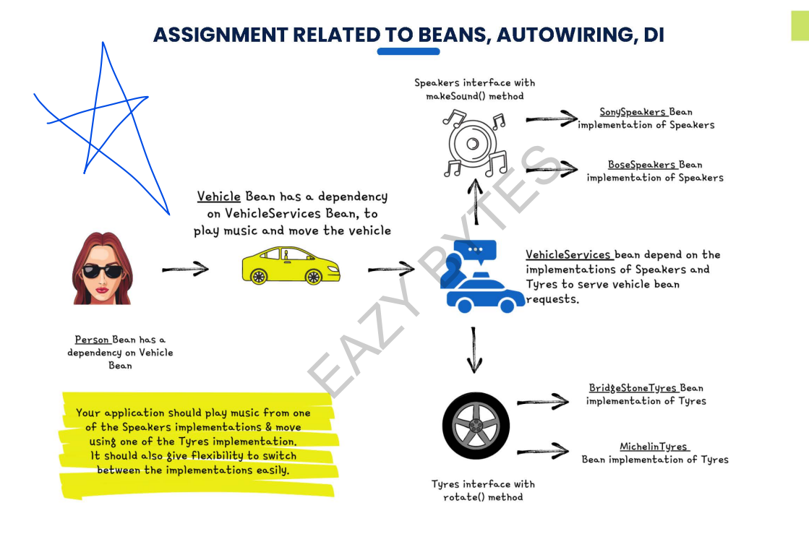

# Assignment related to Beans, Autowiring, DI
- Person bean has a dependency on Vehicle bean.
- Vehicle bean has a dependency on Vehicle service bean, to play music nad move the vehicle.
- Vehicle Service bean depend on the implementations of Speaker and Tyre to serve the vehicle bean request. 
- Speaker interface with makeSound() method
  -SonySpeaker bean implementation of Speakers
  - BoseSpeaker Bean implementation of Speakers 
- Tyre Interface with rotate() method 
  - BridgeStoneTyres Bean implementation of Tyres 
  - MichelinTyres Bean implementations of Tyre

**The Application should play Music from one of the soeaker implementations and move using 
on of the Tyres implementations. It should also give flexibility to switch between the implementations easily**

