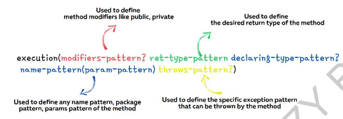

# AOP

<a herf = "https://www.javatpoint.com/spring-aop-tutorial"> Source </a> <br>
<a herf = "https://docs.spring.io/spring-framework/docs/current/reference/html/core.html#aop-introduction-defn"> Spring Official Docs </a>
<br>

**Aspect Oriented Programming** (AOP) compliments OOPs in the sense that it also provides modularity. But the key unit
of
modularity is aspect than class.<br>

AOP breaks the program logic into distinct parts (called concerns). It is used to increase modularity by **cross-cutting
concerns.** <br>

A cross-cutting concern is a concern that can affect the whole application and should be centralized in one location
in code as possible, such as transaction management, authentication, logging, security etc.<br>

1. Why use AOP?
   It provides the pluggable way to dynamically add the additional concern before, after or around the actual logic.
   Suppose there are 10 methods in a class as given below:

````java
class A {
    public void m1() {...}

    public void m2() {...}

    public void m3() {...}

    public void m4() {...}

    public void m5() {...}

    public void n1() {...}

    public void n2() {...}

    public void p1() {...}

    public void p2() {...}

    public void p3() {...}
}  
````

There are 5 methods that starts from m, 2 methods that starts from n and 3 methods that starts from p.<br>

#### Understanding Scenario

I have to maintain log and send notification after calling methods that starts from m.<br>

#### Problem without AOP

We can call methods (that maintains log and sends notification) from the methods starting with m. In such scenario,
we need to write the code in all the 5 methods.<br>

But, if client says in the future, I don't have to send notification, you need to change all the methods. It leads to
the maintenance problem.

#### Solution with AOP

We don't have to call methods from the method. Now we can define the additional concern like maintaining log,
sending notification etc. in the method of a class. Its entry is given in the xml file.<br>

In the future, if client says to remove the notifier functionality, we need to change only in the xml file. So,
maintenance is easy in AOP.

### Where use AOP?

AOP is mostly used in following cases:

to provide declarative enterprise services such as declarative transaction management.
It allows users to implement custom aspects.

## AOP Concepts and Terminology

AOP concepts and terminologies are as follows:

- Join point
- Advice
- Pointcut
- Introduction
- Target Object
- Aspect
- Interceptor
- AOP Proxy
- Weaving

### Join point:

Join point is any point in your program such as method execution, exception handling, field access etc. Spring supports
only method execution join point.

### Advice:

Advice represents an action taken by an aspect at a particular join point. There are different types of advices:

1. **Before Advice**: it executes before a join point.

2. **After Returning Advice**: it executes after a joint point completes normally.

3. **After Throwing Advice**: it executes if method exits by throwing an exception.

4. **After (finally) Advice**: it executes after a join point regardless of join point exit whether normally or
   exceptional return.

5. **Around Advice**: It executes before and after a join point.

### Pointcut

It is an expression language of AOP that matches join points.

### Introduction

It means introduction of additional method and fields for a type. It allows you to introduce new interface to any
advised object.

### Target Object

It is the object i.e. being advised by one or more aspects. It is also known as proxied object in spring because Spring
AOP is implemented using runtime proxies.

### Aspect

It is a class that contains advices, joinpoints etc.

### Interceptor

It is an aspect that contains only one advice.

### AOP Proxy

It is used to implement aspect contracts, created by AOP framework. It will be a JDK dynamic proxy or CGLIB proxy in
spring framework.

### Weaving

It is the process of linking aspect with other application types or objects to create an advised object. Weaving can be
done at compile time, load time or runtime. Spring AOP performs weaving at runtime.

## AOP Implementations

AOP implementations are provided by:

- AspectJ
- Spring AOP
- JBoss AOP
- Spring AOP

## Spring AOP

it can be used by 3 ways given below. But the widely used approach is Spring AspectJ Annotation Style. The 3 ways to use
spring AOP are given below:

1. By Spring1.2 Old style (dtd based) (also supported in Spring3)
2. By AspectJ annotation-style
3. By Spring XML configuration-style(schema based)

# Implementations

Annotation in the Project config class

````java
import org.springframework.context.annotation.EnableAspectJAutoProxy;

@EnableAspectJAutoProxy
public class ProjectConfig() {

}
````

Then we need to create the aspect logic, that we want to be executed, whenever a method is intercepted by the AOP
framework, definitely, we can't write the logic without a method and these methods has to present inside the java class.
We need to create a java class.

Let's make a class named LogerAspect(){}

````java
package aspects;

import org.aspectj.lang.annotation.Aspect;
import org.springframework.stereotype.Component;

@Aspect
@Component
public class LoggerAspects {
    public void log
}

````

On this class we use two annotations @Aspect and @Component.

@Component (Stereotype Annotation) --> will convert this class into the spring bean. Whenever we want certain logic
present
inside the class needs to act as Aspect logic, and we have to make sure that the clas is acting as a bean inside the
spring framework.

@Aspect --> In order to differentiate between a normal bean and an Aspect bean , we need to mention this Annotation.

<br>
With these two annotations, our class is ready to act as a Bean and a Aspect. We can write any number of methods
in this class, that will hold the aspect logic. 

##### Method Log inside our class.

This method will ave some aspect logic. **TODO: Have to describe this.**

On the Top of this method we have to use the advice (before, around, after etc ). <br>
Based upon the advice that we give on top of this aspect logic method, spring framework will intercept my actual method
call, and will try to execute the log present inside this aspect methods.

In our case we have used @Around type of advice.

By Mentioning the @Advice annotation, this means my Spring executes this log present inside this aspect method, around
the
actual method invocation like, @before and @After but post that, my spring framework will ask me, you have thousands of
methods inside your application, which method I need to intercept, for the same,

inside **Advice** annotation, @Around(**Here we need to do the configurations** --> which will tell the spring
framework,
that which methods will need to be intercepted, There are multiple approaches -->

*Most popularly used approach*

1. Aspect J cut expression --> This is the execution expression approach, as we can also see in our code.

````java
import org.aspectj.lang.annotation.Around;

@Around(*execution)
````

Since, we hare trying to execute a method, we are using **execution** there,and inside this execution, we need to pass
a **regix** or **pointcut** expression, which will guide my spring framework, which method will need to be executed,
and the format for that is:


As we can see in the image above that, we can pass the four different types of pattern in our @Advice call-->

1. **Modifier Pattern** -->  optional (the question mark at the end of this pattern depicts that), using this modifier
   pattern,
   weather public methods needs to be intercepted or private method needs to be intercepted, so all those modifiers we
   can define. **However, if we are fine to intercept any kind of methods inside my application, we can simply ignore
   this, because *modifiers-pattern* is and **optional**. Post that we need to give space, followed by return type
   pattern.
2. **Return-type-pattern** --> Sometimes you may want to apply this AOP pattern for only methods that are returning
   **String value, or int value or any object type** so, this kind of configurations also, you can mention under the
   return type pattern. This pattern is a **mandatory** one. As also we don't see the question mark at the end of
   the return-type-pattern. Followed by declaring-type-pattern.
3. **Declaring-type-pattern** --> In this pattern, we need to mention, what is th epackage details that you want to
   consider by the Spring Framework to intercept the java methods. Sometimes, inside a package, we want to only
   intercept certain methods, with certain name pattern, so in those scenarios, after declaring the type-pattern we can
   also declare the name pattern.
4. Name-pattern **(** Params-Pattern:  Weather a method need to have single parameter or two parameters or how many
   parameters, types of pattern.
   All these patterns travel with each other, alongside these patterns.
   All the mandatory patterns are --> return type pattern and through Pattern.
   /* --> You can also use this Astric value as the wild card to intercept all kinds of method inside my spring
   application.  **)**
5. throws-pattern --> **optional** allows us to catch the executions thrown by the methods .


